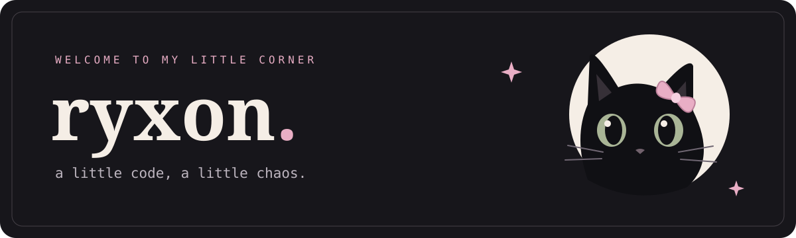

 

### hey, i'm ryxon 🐈‍⬛

building things with code & a little curiosity.

 

 
 

`html + css` · `javascript` · `python`

 

### a little snack for the snake

<picture>
  <source media="(prefers-color-scheme: dark)" srcset="https://raw.githubusercontent.com/ryxonpy/ryxonpy/output/snake-dark.svg" />
  
</picture>

 
 

[browse my projects ↗](https://github.com/ryxonpy?tab=repositories)

curiosity didn't kill this cat. it taught it to code.

